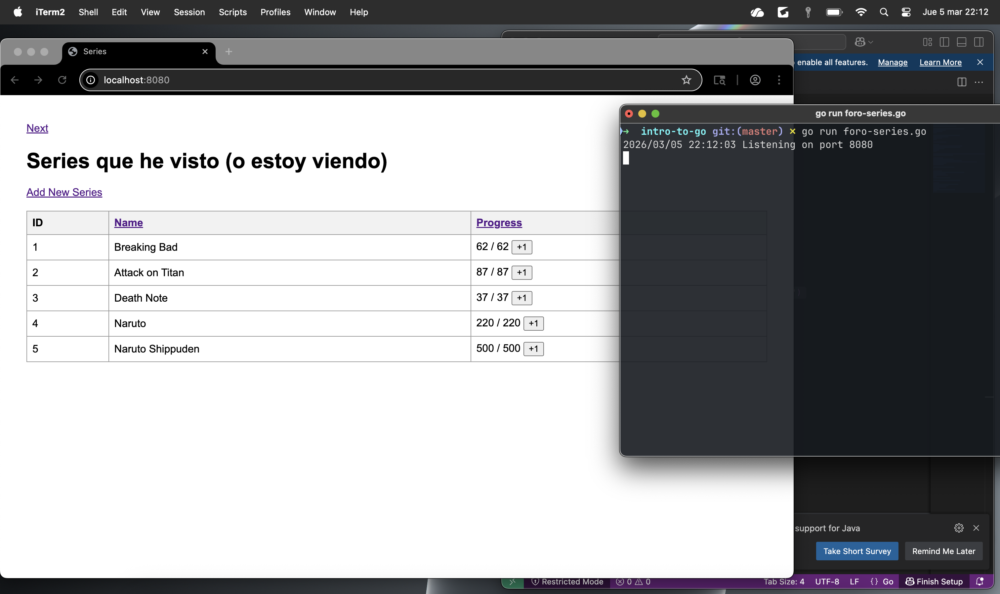

Series Tracker – HTTP Server in Go

Servidor HTTP construido utilizando TCP puro en Go, sin usar el paquete net/http.
El sistema permite visualizar, crear y actualizar series almacenadas en una basede datos SQLite.

¿Cómo ejecutar el proyecto?

    1. Clonar el repositorio.

    2. Entrar a la carpeta del proyecto.

    3. Ejecutar: go run foro-series.go

    4. Abrir en navegador: http://localhost:8080/

Base de datos.

    En el repositorio se incluye un archivo series.db que es una base de datos e    en SQLite, contiene la tabla series(id PK, name, current_episode, total_epis    odes)

Funcionalidades del sistema.

    Servidor HTTP usando net.Listen
    Parseo manual de la primera línea del request HTTP
    Construcción manual de respuestas HTTP
    Renderizado dinámico de HTML (Server-Side Rendering)
    Formulario HTML con método POST en la ruta /create
    Inserción en SQLite
    Redirección 303 (POST/Redirect/GET)
    Botón +1 usando fetch() sin recargar manualmente la página
    Ruta /update con método POST
    Paginación usando LIMIT y OFFSET
    Ordenamiento por columna
    Servicio de archivos estáticos (CSS)

Screenshot.

La siguiente imagen muestra el servidor en funcionamiento:

